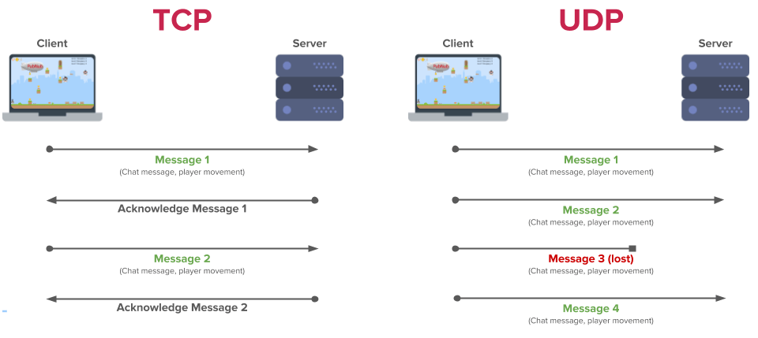
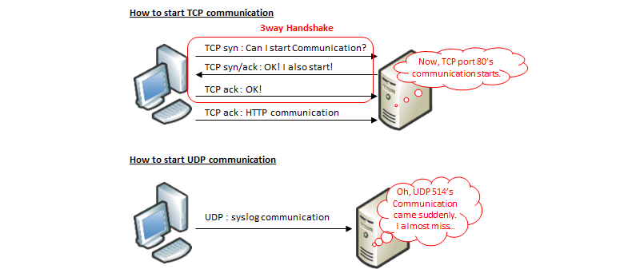

### Модель OSI
<table>
	<tr>
	    <th colspan="7">Модель</th>
        	</tr >
	    <tr>
        <th colspan="2">Уровень (layer)</th>
        <!-- <th></th> -->
        <th>Тип данных</th>
        <th>Функции</th>
        <th>Примеры</th>
        <th>Оборудование</th>
        </tr>
    <tr>
        <th rowspan="4">Host layers</th>
        <td>7. Прикладной (application)</td>
        <td rowspan="3">Данные</td>
        <td>Доступ к сетевым службам</td>
        <td>HTTP, FTP, POP3, WebSocket</td>
        <td rowspan="4">Хосты (клиенты сети), Межсетевой экран</td>
            </tr>
      <tr>
        <td>6. Представления (presentation)</td>
        <!-- <td>sds</td> -->
        <td>Представление и шифрование данных</td>
        <td>ASCII, EBCDIC, JPEG, MIDI</td>
        <!-- <td>sdsd</td> -->
            </tr>     
            <tr>
        <td>5. Сеансовый (session)</td>
        <!-- <td>sds</td> -->
        <td>Управление сеансом связи</td>
        <td>RPC, PAP, L2TP, gRPC</td>
        <!-- <td>sdsd</td> -->
            </tr>    
        <td>4. Транспортный (transport)</td>
        <td>Сегменты (segment) /Датаграммы (datagram)</td>
        <td>Прямая связь между конечными пунктами и надёжность</td>
        <td>TCP, UDP, SCTP, Порты</td>
        <!-- <td>sdsd</td> -->
            </tr>   
 <tr>
        <th rowspan="3">Media layers</th>
        <td>3. Сетевой (network)</td>
        <td>Пакеты (packet)</td>
        <td>Определение маршрута и логическая адресация</td>
        <td>IPv4, IPv6, IPsec, AppleTalk, ICMP</td>
        <td>Маршрутизатор, Сетевой шлюз, Межсетевой экранн</td>
            </tr>
            <tr>
        <td>2. Канальный (data link)</td>
        <td>Биты (bit)/Кадры (frame)</td>
        <td>Физическая адресация</td>
        <td>PPP, IEEE 802.22, Ethernet, DSL, ARP, сетевая карта</td>
        <td>Сетевой мост, Коммутатор, точка доступа</td>
            </tr>     
             <tr>
        <td>1. Физический (physical)</td>
        <td>Биты (bit)</td>
        <td>Работа со средой передачи, сигналами и двоичными данными</td>
        <td>USB, RJ («витая пара», коаксиальный, оптоволоконный) радиоканал</td>
        <td>Концентратор, Повторитель (сетевое оборудование)</td>
            </tr>  
</table>

###Разница между TCP и UDP
Вообще, протоколы транспортного уровня широко применяются в современных сетях. Именно они позволяют гарантировать доставку сообщения до адресата, а также сохраняют правильную последовательность передачи данных. При этом протоколы имеют ряд различий, что позволяет использовать их профильно, для решения своих задач каждый.

Протокол TCP (Transmission Control Protocol) – это сетевой протокол, который «заточен» под соединение. Иными словами, прежде, чем начать обмен данными, данному протоколу требуется установить соединение между двумя хостами. Данный протокол имеет высокую надежность, поскольку позволяет не терять данные при передаче, запрашивает подтверждения о получении от принимающей стороны и в случае необходимости отправляет данные повторно. При этом отправляемые пакеты данных сохраняют порядок отправки, то есть можно сказать, что передача данных упорядочена. Минусом данного протокола является относительно низкая скорость передачи данных, за счет того что выполнение надежной и упорядоченной передачи занимает больше времени, чем в альтернативном протоколе UDP.

Протокол UDP (User Datagram Protocol), в свою очередь, более прост. Для передачи данных ему не обязательно устанавливать соединение между отправителем и получателем. Информация передается без предварительной проверки готовности принимающей стороны. Это делает протокол менее надежным – при передаче некоторые фрагменты данных могут теряться. Кроме того, упорядоченность данных не соблюдается – возможен непоследовательный прием данных получателем. Зато скорость передачи данных по данному транспортному протоколу будет более высокой.

***
#####ЗАКЛЮЧЕНИЕ И НАГЛЯДНОЕ СРАВНЕНИЕ
Приведем несколько основных пунктов:
*   Надежность: в этом случае предпочтительнее будет протокол TCP, за счет подтверждения получения данных, повторной отправки в случае необходимости, а также использованию такого инструмента как тайм-аут. Протокол UDP такого инструментария не имеет, а потому при получении отправленные данные могут приходить не полностью;
*   Упорядоченность: опять будет предпочтительнее TCP, поскольку этот протокол гарантирует передачу пакетов данных именно в том порядке, в котором они были отправлены. В случае с UDP такой порядок не соблюдается;
*   Скорость: здесь уже лидировать будет UDP, так как более тяжеловесному TCP-протоколу будет требоваться больше времени для установки соединения, подтверждения получения, повторной отправки данных и т.д. ;
*   Метод передачи данных: в случае с TCP данные передаются потоково, границы фрагментов данных не имеют обозначения. В случае с UDP данные передаются в виде датаграмм – проверка пакетов на целостность осуществляется принимающей стороной только в случае получения сообщения. Также пакеты данных имеют определенные обозначения границ;
